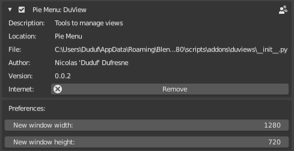
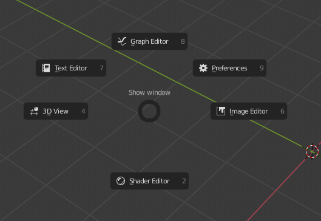

Welcome to the official *DuViews* documentation.

DuViews is a very simple addon for *Blender* which adds items in the *Window* menu and a new pie menu to quickly open new windows with a single space, from anywhere in *Blender*. It is very useful when you temporarily need to work in a specific area for example, but you want to keep your current workspace as it is.

## License

DuViews is licensed under the [GNU General Public License v3](https://rainboxlab.org/license-gpl/).  
This documentation is licensed under the [Gnu Free Documentation License](https://www.gnu.org/licenses/fdl-1.3.html).

## Install

The add-on can be downloaded from [Rainbox Lab.](https://rainboxlab.org)

Then, you can install it from the preferences of *Blender*, *Add-ons* tab. Once installed, it will be listed in the *Pie Menu* section where you can activate it.

!!! note
    This add-on works only with Blender 2.8 and more recent versions.

## Settings

In the preferences of *Blender*, you can set the default size of the new windows.

## Usage

Some items are added in the main *Window* menu of the top bar.

You can also quickly open windows from a pie menu with the `[Ctrl] + [W]` shortcut.

*Last Modified on *